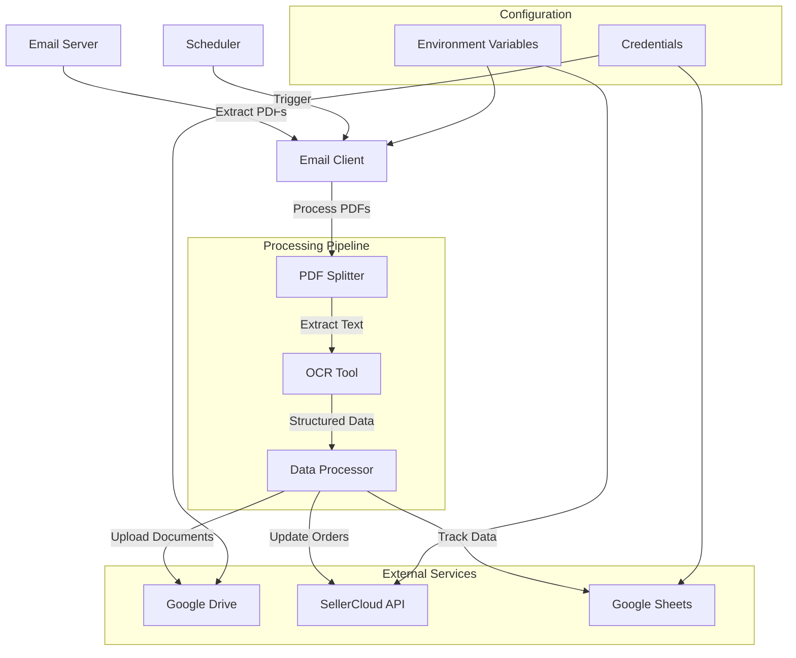
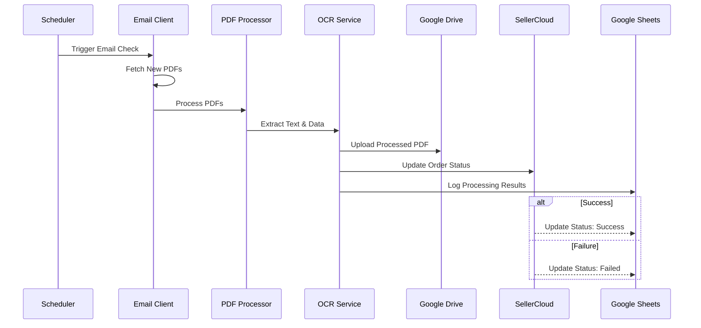

# Invoice-OCR

[](https://codespaces.new/concaption/Invoice-OCR)

An automated system for processing invoices and Bills of Lading (BOL) using OCR, with integration to SellerCloud and Google Drive.

## Features

- 📧 Automated email attachment extraction
- 📝 OCR processing of PDF invoices and BOLs
- 🔄 Integration with SellerCloud for order management
- 📊 Google Sheets integration for data tracking
- 📁 Google Drive integration for document storage
- ⏰ Scheduled processing with configurable intervals

## System Architecture



## Component Flow



## Prerequisites

- Python 3.9+
- Google Cloud Platform account with API access
- SellerCloud account with API credentials
- Email account with IMAP access

## Installation

1. Clone the repository:
```bash
git clone https://github.com/concaption/Invoice-OCR.git
cd Invoice-OCR
```

2. Create and activate a virtual environment:
```bash
python -m venv venv
source venv/bin/activate  # Linux/Mac
# or
.\venv\Scripts\activate  # Windows
```

3. Install dependencies:
```bash
pip install -r requirements.txt
```

4. Copy the example environment file and configure your settings:
```bash
cp .env.example .env
```

## Configuration

Edit the `.env` file with your credentials:

```env
# Required environment variables
EMAIL_ADDRESS=your_email@example.com
EMAIL_PASSWORD=your_email_password
IMAP_SERVER=imap.gmail.com
CREDENTIALS_FILE_PATH=path/to/google_credentials.json
OPENAI_API_KEY=your_openai_api_key
SELLER_EMAIL_ADDRESS=your_seller_email
SELLER_PWD=your_seller_password
```

## Project Structure

```
Invoice-OCR/
├── app/
│   ├── config.py
│   ├── scheduler.py
├── utils/
│   ├── drive.py
│   ├── emailclient.py
│   ├── ocr.py
│   ├── pdf_splitter.py
│   ├── schema.py
│   └── seller_cloud.py
├── main.py
├── requirements.txt
└── .env
```

## Usage

1. Start the FastAPI application:
```bash
python main.py
```

2. The system will automatically:
   - Check for new emails with PDF attachments
   - Process PDFs using OCR
   - Upload documents to Google Drive
   - Update SellerCloud orders
   - Track processing in Google Sheets

## Scheduling

The system uses APScheduler for automated processing. Configure the schedule in your `.env` file:

```env
SCHEDULE_TIME="0 1 * * *"  # Runs daily at 1 AM
```

## Error Handling

- Failed OCR processes are logged
- Upload failures are tracked
- Email processing errors are captured
- All errors are logged with timestamps

## Contributing

1. Fork the repository
2. Create your feature branch
3. Commit your changes
4. Push to the branch
5. Create a Pull Request

## License

This project is licensed under the MIT License - see the LICENSE file for details.

[](https://www.upwork.com/fl/~01506cf82cf7f3671e)